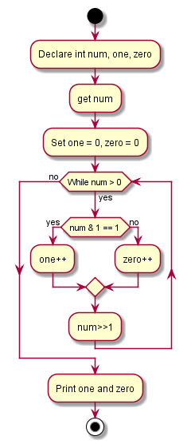

# Binary-Zeros-Ones-of-Decimal-Number
Files for Binary zeros and ones of a given Decimal Number.

It consist of the following folders:

- app
- assets
- docs
- issue
- src

The following is the flow chart for the task:

