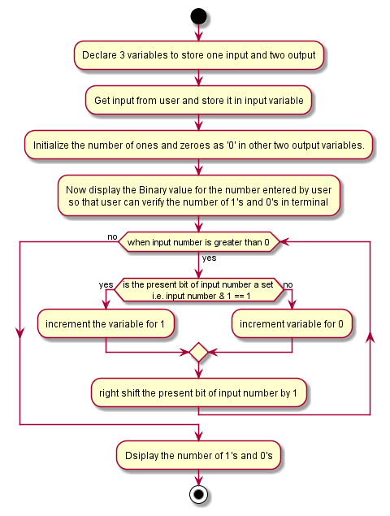

# Binary-Zeros-Ones-of-Decimal-Number
- Objective:

    To create a program which is used to find the number of binary ones and binary zeroes in a given decimal numbers.

The repository consists of following directories:

- Assets:

    Assets are flowchart files. We created our flowchart for the task using Plantuml and stored it here.

- Docs:

    It contains various issues we faced while developing Source for the given task. It is useful for future purpose while debugging a same kind of issue.

- Src:

    It contains our task's source. We can pull this source and work with it on any required time.

The following is the flow chart for the task:

- Version:

    binary_zeroes_and_ones_of_decimal_numbers Version_v1.0.0